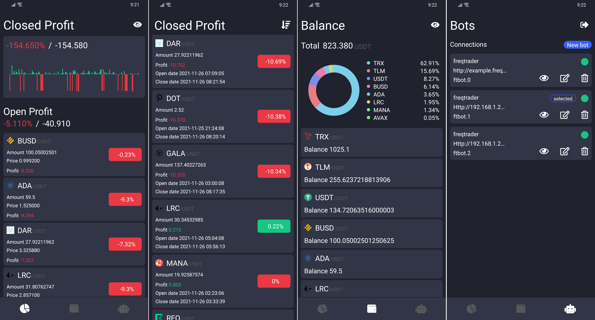

<p align="center">
  <a href="http://www.nativescript.org">
    
    
  </a>
</p>

Community mobile application created for the [Freqtrade](https://github.com/freqtrade/freqtrade/) bot, made
with [NativeScript](http://www.nativescript.org)/Nativescript-Vue

## What does?

- Dashboard screen where you can see the Closed profit and the open profit.
- Monitoring of all open operations.
- History of all closed operations.
- Total balance.
- Manage servers. The application supports multiple bots.




## Contribute

Anyone can contribute to this project. All you have to do is the following:

- Make a fork.
- Make your changes. At this point it is important to know how [Nativescript](https://docs.nativescript.org) works and how to install the environment.
- Upload your changes to your branch.
- Do a PR.

## Bot Freqtrade by default

When you start the application, it will have by default the parameters to create a connection with a bot launched of freqtrade. You can find the settings [here](https://github.com/vallemar/freqtrade-app/blob/master/app/pages/NewBot.vue).

## Configuration for your freqtrade server.

We recommend using [docker and docker-compose](https://www.freqtrade.io/en/stable/docker_quickstart/) for their simplicity. Important points to enable the bot API and have connectivity.

```
//docker-compose.yml

version: '3'
services:
    mybot
        ...
        ports:
          - "0.0.0.0:8080:8080" #important ip 0.0.0.0
```

```json
//config.json

"api_server": {
    "enabled": true,
    "listen_ip_address": "127.0.0.1",
    "listen_port": 8080,
    "verbosity": "error",
    "enable_openapi": false,
    "jwt_secret_key": "YOUR_SECRET_HERE",
    "CORS_origins": [],
    "username": "freqtrader",
    "password": "YOUR_PASSWORD_HERE"
},
```

## ROADMAP

- Stable application on Android. 🔨
- Stable application on iOS. 🔨
- Publish base APP on Play Store (Android). 🔨
- Publish base APP on Apple Store (iOS). 🔨
- 🏁 Start/Stop/StopBuy bot.
- 🔎 View config/whitelist/blacklist Bot.
- 💸 Implement Forcesell.
- 📱 Widget for Android.
- 📈 Screen Trade.
- 🔥 Backend/APP integration with Firebase.
- 🧑🏽‍🤝‍🧑🏽 ... Ideas to contribute 🚀
